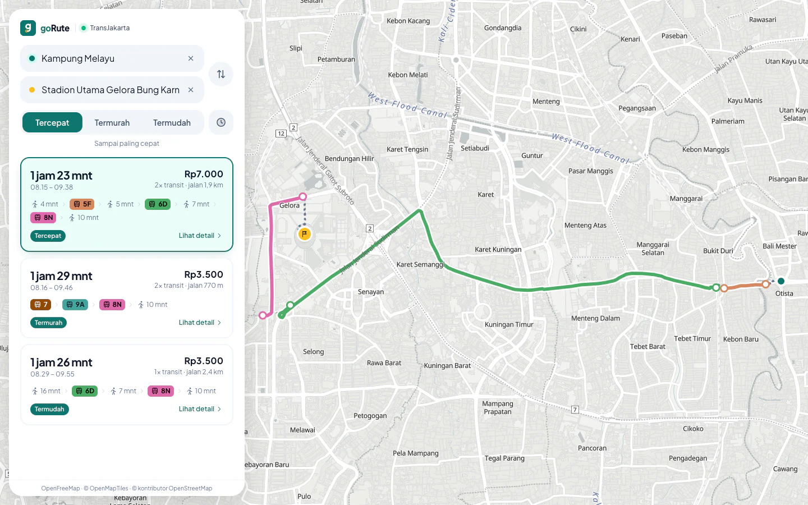
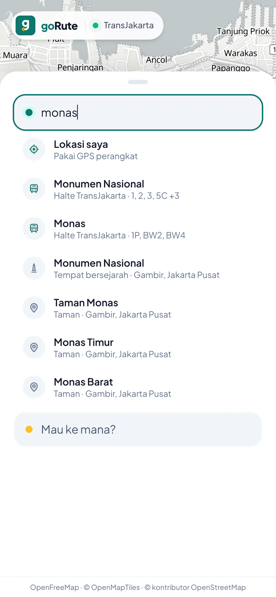
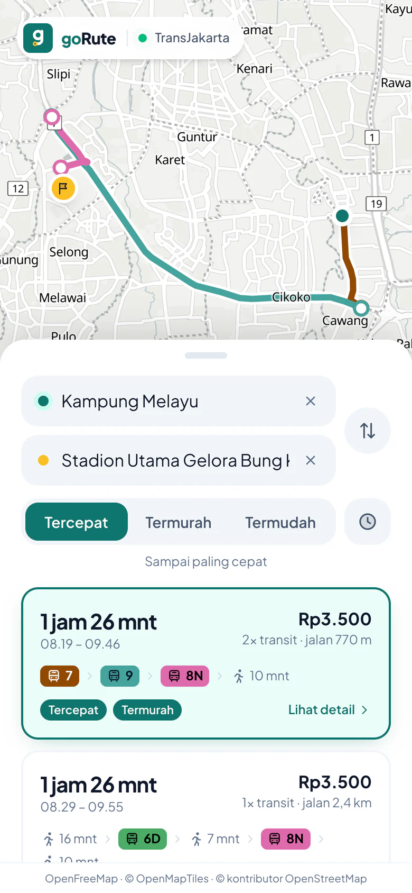
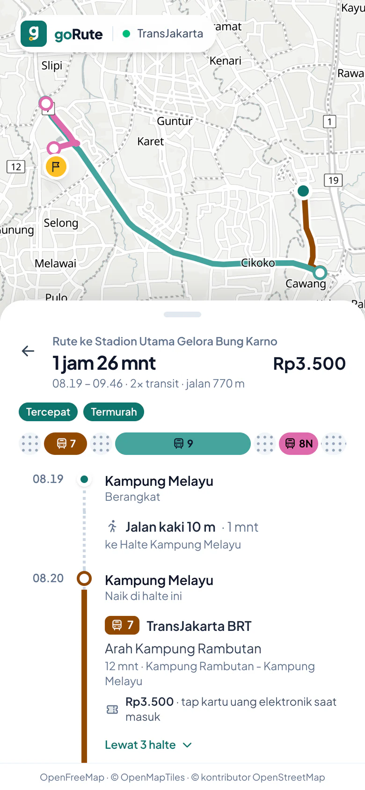
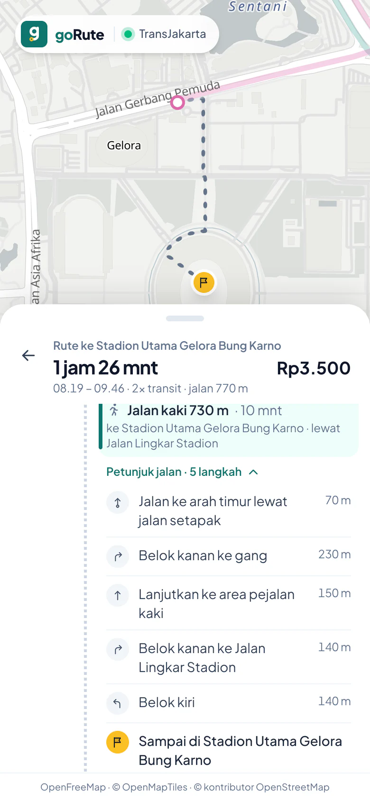
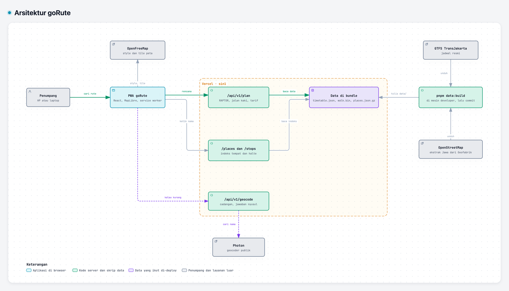
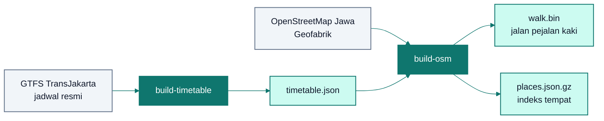

<!-- markdownlint-disable MD013 MD033 MD041 -->

<div align="center">


# goRute

**Naik TransJakarta tanpa nebak-nebak.**

Cari rute transportasi umum tercepat, termurah, dan termudah di Jabodetabek, dari pintu ke pintu: jalan kaki, naik di halte mana, transit, tarif, dan jamnya.<br />
PWA, tanpa akun, dan tetap bisa dibuka tanpa internet.

### [Coba di gorute.vercel.app →](https://gorute.vercel.app)

[](https://gorute.vercel.app)
[](https://gtfs.transjakarta.co.id/files/file_gtfs.zip)
[](#fitur)
[](https://react.dev)
[](https://www.typescriptlang.org)
[](https://vite.dev)
[](https://maplibre.org)
[](https://www.openstreetmap.org)
[](https://vercel.com)

[Fitur](#fitur) · [Cara kerja](#cara-kerja) · [API](#api) · [Mulai lokal](#mulai-lokal) · [Sumber data](#sumber-data) · [Roadmap](#roadmap)

</div>

<p align="center">
  
</p>

> [!NOTE]
> **goRute sudah live di [gorute.vercel.app](https://gorute.vercel.app).** Vercel men-deploy `main`, dan API-nya berjalan di Singapura.
> Data saat ini TransJakarta: BRT, Non-BRT, Mikrotrans, Transjabodetabek, dan Royaltrans. KRL, MRT, dan LRT menyusul.

## Kenapa goRute

Naik TransJakarta itu murah, tapi nyari rutenya sering bikin pusing: halte mana yang paling dekat, koridor apa yang lewat, turun di mana buat transit, jalan kakinya lewat mana, dan bayarnya berapa (Rp2.000 sebelum jam 7, satu tiket berlaku tiga jam untuk transfer).

goRute menghitung semuanya dari jadwal resmi TransJakarta dan jalan sungguhan dari OpenStreetMap. Hasilnya tiga cara mengurutkan opsi, langkah demi langkah sampai pintu tujuan, dan jam yang jujur kalau busnya baru ada nanti.

<table>
  <tr>
    <td align="center"></td>
    <td align="center"></td>
    <td align="center"></td>
    <td align="center"></td>
  </tr>
  <tr>
    <td align="center"><b>Cari tempat</b><br /><sub>Halte, mal, kampus, "kfc blok m"</sub></td>
    <td align="center"><b>Opsi rute</b><br /><sub>Tercepat, termurah, termudah</sub></td>
    <td align="center"><b>Detail</b><br /><sub>Naik dan turun di mana, bayar berapa</sub></td>
    <td align="center"><b>Jalan kaki</b><br /><sub>Belok demi belok sampai tujuan</sub></td>
  </tr>
</table>

<div align="center">

| 240 rute | 7.819 titik halte | ~157 ribu tempat | 102 test |
| :---: | :---: | :---: | :---: |
| BRT sampai Mikrotrans | dari GTFS resmi | dari OpenStreetMap | lint, unit, data, build |

</div>

## Fitur

- **Dari pintu ke pintu.** Jalan kaki ke halte, naik, transit, sampai jalan kaki ke tujuan, masing-masing dengan jam. Ketuk satu langkah, peta memperbesar ke bagian itu.
- **Tiga urutan.** Tercepat (sampai paling cepat), Termurah (ongkos paling hemat), dan Termudah (transit dan jalan kaki paling sedikit). Opsi yang kalah di semua aspek dibuang.
- **Jalan kaki sungguhan.** Mengikuti jalan dan gang dari OpenStreetMap, lewat JPO dan penyeberangan, tidak lewat tol atau busway, dengan petunjuk seperti "Belok kanan ke Jalan Lingkar Stadion".
- **Tarif yang benar.** Rp3.500, Rp2.000 pukul 05.00–07.00, satu tiket berlaku 3 jam untuk transfer, Mikrotrans gratis, dan Royaltrans dengan tarif premiumnya.
- **Cari tempat apa saja.** Halte langsung dari jadwal (paham "St.", "Sbr.", Monas, GBK), lalu ~157 ribu tempat lengkap dengan kelurahan dan kotanya: "ui depok", "rs fatmawati", "kfc blok m". Photon menyusul kalau indeks kita kurang.
- **Pilih jam berangkat.** Sekarang, hari ini, atau besok. Kalau bus di sekitar libur hari itu, goRute menawarkan hari berikutnya yang ada busnya.
- **Enak di HP.** Panel bawah yang bisa ditarik, kolom asal dan tujuan yang dilipat jadi "A → B" di layar pendek, riwayat "Terakhir dicari", dan tombol back HP yang menutup detail.
- **Bisa dipasang dan dibuka tanpa internet.** PWA dengan service worker yang menyimpan app, style, dan tile peta.
- **Ramah untuk semua.** Kontras teks WCAG AA, fokus keyboard yang kelihatan, area sentuh 44 px, dan semua animasi mengikuti *reduce motion*.
- **Privat.** Tanpa akun. Riwayat tempat hanya di perangkat, koordinat di URL dibulatkan sekitar 11 m, dan CSP ketat dari `vercel.json`.

### Alur pakai

```mermaid
%%{init: {"theme":"base","themeVariables":{"fontFamily":"ui-sans-serif, system-ui","primaryTextColor":"#0f172a","lineColor":"#0f766e"},"flowchart":{"curve":"basis"}}}%%
flowchart LR
    A["1 · Asal<br/>halte, tempat, GPS, atau ketuk peta"] --> B["2 · Tujuan<br/>nama, singkatan, cabang dekat landmark"]
    B --> C["3 · Jam dan urutan<br/>sekarang, hari ini, besok"]
    C --> D["4 · Opsi rute<br/>Tercepat · Termurah · Termudah"]
    D --> E["Detail<br/>jalan, naik, transit, tiba"]
    E --> F["Peta<br/>zoom ke langkah yang diketuk"]

    classDef langkah fill:#f1f5f9,stroke:#0f766e,color:#0f172a,stroke-width:1.5px;
    classDef hasil fill:#ccfbf1,stroke:#0f766e,color:#0f172a,stroke-width:1.5px;
    classDef peta fill:#fbbf24,stroke:#0f172a,color:#0f172a,stroke-width:1.5px;
    class A,B,C langkah;
    class D,E hasil;
    class F peta;
```



> [!TIP]
> Di HP, buka gorute.vercel.app lalu pilih **Tambahkan ke Layar Utama**. goRute terbuka seperti app biasa, dan peta yang pernah dilihat tetap tampil saat sinyal hilang.

## Cara kerja

<sub>KODE → DIAGRAM · Peta sistem yang menaut ke baris kodenya</sub>

<a href="https://bintangfabian.github.io/goRute/arsitektur.html">
<picture>
  <source media="(prefers-color-scheme: dark)" srcset="docs/gambar/arsitektur-gelap.png" />
  
</picture>
</a>

**[Buka diagram interaktif ↗](https://bintangfabian.github.io/goRute/arsitektur.html)** · [telusuri jalur rencana rute ↗](https://bintangfabian.github.io/goRute/arsitektur.html#route=penumpang~data) · [sumber JSON](docs/arsitektur.archify.json)

Seluruhnya TypeScript dan dirancang jalan gratis di Vercel (plan Hobby). Web app disajikan sebagai file statis, API berjalan sebagai Vercel Functions, dan mesin rute membaca jadwal dari file yang ikut di-deploy. Tidak ada server atau database yang harus selalu nyala.

### Mesin rute

```mermaid
%%{init: {"theme":"base","themeVariables":{"fontFamily":"ui-sans-serif, system-ui","primaryTextColor":"#0f172a","lineColor":"#0f766e"},"flowchart":{"curve":"basis"}}}%%
flowchart LR
    Q["Permintaan<br/>asal, tujuan, jam"] --> W["Halte terdekat<br/>jalan kaki lewat graf OSM"]
    W --> R["RAPTOR<br/>putaran ke-k = k kali naik"]
    R --> X["Alternatif<br/>tanpa rute tercepat, tanpa premium, versi mudah"]
    X --> F["Tarif<br/>GTFS + aturan TransJakarta"]
    F --> S["Saring<br/>buang yang kalah di semua aspek"]
    S --> O["Tiga urutan<br/>Tercepat · Termurah · Termudah"]

    classDef langkah fill:#f1f5f9,stroke:#0f766e,color:#0f172a,stroke-width:1.5px;
    classDef inti fill:#0f766e,stroke:#0f766e,color:#ffffff,stroke-width:1.5px;
    classDef akhir fill:#fbbf24,stroke:#0f172a,color:#0f172a,stroke-width:1.5px;
    class Q,W,X,F,S langkah;
    class R inti;
    class O akhir;
```



<details>
<summary><b>Detail mesin rute</b>: data, RAPTOR, pencarian, jalan kaki, tarif</summary>

- **Data.** `scripts/gtfs/build.ts` mengelompokkan perjalanan GTFS menjadi *pola* (rute + urutan halte + waktu tempuh yang sama), mengekspansi `frequencies.txt` menjadi jam keberangkatan, dan menempelkan halte ke `shapes.txt` untuk garis di peta.
- **RAPTOR.** Putaran ke-*k* mencari waktu tiba paling awal di setiap halte dengan maksimal *k* kali naik, sehingga hasilnya himpunan Pareto antara waktu tiba dan jumlah transit.
- **Pencarian.** Tiap permintaan menjalankan pencarian normal (jalan ≤1,2 km, transfer ≤500 m; sampai 2,5 km kalau dalam 1,2 km tidak ada halte yang dilewati bus hari itu, misalnya cuma halte Royaltrans yang hanya beroperasi Senin–Jumat), pencarian "mudah" (jalan ≤600 m, transfer ≤200 m, maks 3 kali naik), dan pencarian ulang tanpa tiap rute dari opsi tercepat untuk memunculkan alternatif. Kalau ada opsi yang naik bus premium (misal Royaltrans), pencarian diulang tanpa semua bus premium supaya opsi tarif reguler ikut muncul: RAPTOR hanya membandingkan jam tiba dan jumlah naik, bukan tarif. Hasil yang sama digabung dan opsi yang jauh lebih lambat dari yang tercepat dibuang (opsi yang lebih murah boleh lebih lama 1 menit per Rp250 yang dihemat), begitu juga opsi yang kalah dari opsi lain di semua aspek (jam tiba, lama perjalanan, tarif, transit, jalan kaki). Opsi yang hampir kembar juga dibuang: selisih waktu sampai 5 menit (atau 10% dari perjalanan yang lebih pendek) dan jalan kaki sampai 200 m dianggap seri, karena jadwal berbasis interval dan jalan kaki masih estimasi. Opsi hanya dibuang kalau ada opsi lain yang tetap tampil dan mengalahkannya, jadi hasilnya sama apa pun urutan pencariannya.
- **Jalan kaki.** Mengikuti jalan sungguhan dari OpenStreetMap (`data/walk.bin`): titik asal/tujuan dan tiap halte di-*snap* ke jalan terdekat, lalu Dijkstra mencari jalur terpendek ke halte-halte di sekitarnya (kecepatan 4,5 km/jam). Tol, busway, flyover, dan jalan bertanda `foot=no` tidak dilewati; tangga dihitung lebih lambat; jalan privat (perumahan, kampus) dipakai untuk keluar-masuk tapi tidak jadi jalan pintas. Transfer antarhalte juga dihitung lewat jalan (termasuk JPO) saat `pnpm data:build`. Tiap jalan kaki punya petunjuk belok ("Belok kiri ke Jalan …", "Naik jembatan penyeberangan") dan digambar mengikuti jalan. Titik yang lebih dari 400 m dari jalan mana pun kembali ke estimasi garis lurus × 1,3.
- **Tarif.** Dari `fare_attributes`/`fare_rules` GTFS, ditambah aturan yang tidak bisa dinyatakan di GTFS (TransJakarta Rp2.000 pukul 05.00–07.00; satu tiket berlaku untuk transfer selama 3 jam).
- **Kalau tidak ada opsi**, jawabannya menjelaskan sebabnya: halte terlalu jauh, bus di sekitar libur hari itu (beserta tanggal berikutnya yang ada busnya, dalam sepekan), atau memang tidak ada perjalanan.

</details>

### Cari tempat

Halte dicari langsung dari jadwal, jadi selalu instan. Tempat dicari dari indeks OpenStreetMap sendiri (`data/places.json.gz`) yang tahu kelurahan, kecamatan, dan kotanya dari batas administrasi OSM. Kalau hasilnya kurang dari tiga, app bertanya ke [Photon](https://photon.komoot.io) dan hasilnya menyusul di bawah. Jawaban `/places`, `/stops`, dan `/geocode` di-cache CDN Vercel sehari.

## API

| Endpoint | Fungsi |
|---|---|
| `GET /api/v1/status` | Feed yang dimuat dan waktu build data |
| `GET /api/v1/plan?fromLat&fromLon&toLat&toLon[&fromName&toName&time]` | Opsi perjalanan lengkap dengan tarif, garis rute, dan urutan untuk tiap preferensi. Leg jalan kaki membawa `steps` (petunjuk belok); leg bus membawa `headsign` (arah) dan `stops` (halte yang dilewati). `time` (RFC 3339) adalah jam berangkat, dari kemarin sampai sepekan ke depan; tanpa `time` dipakai jam server. Kalau tidak ada opsi, `reason` menjelaskan sebabnya: `far-from-origin`/`far-from-destination`, `no-service-near-origin`/`no-service-near-destination` (dengan `nextServiceDate`), atau `no-trip` |
| `GET /api/v1/stops?q=` | Cari halte dari timetable: instan, paham singkatan (St., Ps., Sbr.) dan alias (Monas, GBK); halte yang namanya dipakai di beberapa tempat diberi petunjuk "Dekat Halte X" |
| `GET /api/v1/places?q=[&lat&lon]` | Cari tempat dari indeks OSM sendiri: instan, dengan kategori ("Mal", "Stasiun", "Jalan") dan wilayahnya ("Pondok Cina, Depok"). Paham nama wilayah dan jenis tempat ("ui depok", "rs fatmawati"), singkatan (UNJ, RSCM, PIM, GBK), spasi yang beda ("atma jaya" = Atmajaya), dan cabang dekat landmark ("kfc blok m", "mcd sarinah": dalam 800 m). `lat`/`lon` (ujung perjalanan yang lain) mendahulukan tempat yang dekat. Kalau hasilnya kurang dari 3, jawabannya membawa `more: true` |
| `GET /api/v1/geocode?q=[&lat&lon]` | Cari tempat lewat Photon publik (lambat, 2–9 detik), dipanggil app hanya kalau `/places` bilang `more`. Kalau Photon gagal, jawabannya tidak di-cache |

Bentuk respons ada di [`shared/api.ts`](shared/api.ts).

## Mulai lokal

Butuh Node.js 22.18 atau lebih baru dan pnpm.

```bash
git clone https://github.com/bintangfabian/goRute.git
cd goRute
pnpm install
pnpm dev
```

Buka alamat yang muncul di terminal. App dan API jalan dari satu proses: plugin di `vite.config.ts` menjalankan `api/` seperti Vercel.

| Perintah | Fungsi |
| --- | --- |
| `pnpm dev` | Server development, app + API |
| `pnpm build` | Cek tipe, lalu build production + PWA ke `dist/` |
| `pnpm preview` | Menyajikan hasil build dengan header keamanan yang sama seperti produksi |
| `pnpm lint` | Lint (oxlint) |
| `pnpm test` | Unit test dan test data (Node test runner) |
| `pnpm check` | Lint, test, dan build sekaligus. Wajib lolos sebelum PR |
| `pnpm data:fetch` | Unduh GTFS TransJakarta dan OSM Jawa (butuh [osmium-tool](https://osmcode.org/osmium-tool/)) |
| `pnpm data:build` | Susun `timetable.json`, `walk.bin`, dan `places.json.gz` |

> [!IMPORTANT]
> Untuk memperbarui data: `pnpm data:fetch && pnpm data:build`, cek `pnpm test`, lalu commit ketiga file di `data/`. Selalu build ulang `walk.bin` setelah `timetable.json` berubah: transfer antarhalte disimpan per urutan halte di timetable.

<details>
<summary><b>Struktur folder</b></summary>

```text
goRute/
├── api/v1/                 # Vercel Functions: plan, places, stops, geocode, status
├── server/                 # logika backend, tidak bergantung pada Vercel
│   ├── router/raptor.ts    # algoritma rute transit (RAPTOR)
│   ├── planner/            # menjalankan pencarian, membentuk opsi, ranking
│   ├── timetable/          # format & loader data/timetable.json
│   ├── fare.ts             # tarif (GTFS + aturan TransJakarta)
│   ├── walk/               # jaringan jalan pejalan kaki (OSM): snap titik ke jalan, Dijkstra, petunjuk belok
│   ├── stops.ts            # pencarian halte dari timetable (instan, plus alias seperti Monas, GBK)
│   ├── places.ts           # pencarian tempat dari indeks OSM sendiri (instan)
│   └── geocode.ts          # Photon publik, cadangan pencarian tempat
├── shared/                 # tipe API, area layanan, jam WIB, teks petunjuk arah: dipakai web dan server
├── src/                    # PWA: React + Vite + Tailwind + Motion + MapLibre
│   └── components/         # termasuk logo, ikon, dan ilustrasi beranimasi
├── public/favicon.svg      # master logo; ikon PWA & Apple dibuat dari sini (pwa-assets.config.ts)
├── scripts/                # pipeline data: unduh GTFS & OSM, build timetable, jalan kaki, indeks tempat
│   └── osm/                # pembaca PBF OpenStreetMap (tanpa dependensi) dan pembangun data OSM
├── data/
│   ├── raw/                # hasil unduhan (tidak di-commit)
│   ├── manual/             # GTFS buatan tangan: MRT, LRT, titik transfer (belum ada)
│   ├── timetable.json      # jadwal hasil pnpm data:build (~2,3 MB), di-commit
│   ├── walk.bin            # jalan pejalan kaki di sekitar halte (~5,9 MB), di-commit
│   └── places.json.gz      # ~157 ribu tempat dan jalan bernama beserta wilayahnya (~2,9 MB), di-commit
├── docs/                   # gambar README dan diagram arsitektur interaktif (GitHub Pages)
├── vite.config.ts          # termasuk plugin yang menjalankan api/ saat dev & preview
└── vercel.json             # region function (Singapura, sin1) dan header keamanan
```

</details>

## Deploy

1. Buka [vercel.com/new](https://vercel.com/new) dan import repo ini. Framework Vite terdeteksi otomatis; tidak perlu mengubah pengaturan build.
2. Selesai. Tidak ada environment variable yang wajib. `PHOTON_URL` opsional untuk memakai instance Photon sendiri.

Batas plan Hobby yang relevan: hanya untuk penggunaan non-komersial, 4 jam CPU aktif dan 1 juta request function per bulan. Satu pencarian rute memakai sekitar 0,1 detik CPU; hasil pencarian tempat di-cache CDN sehari sehingga tidak memakai jatah function.

<details>
<summary><b>Keamanan</b></summary>

- `vercel.json` mengirim Content-Security-Policy (skrip hanya dari goRute sendiri, `<style>` splash lewat hash, peta hanya dari OpenFreeMap, tidak bisa di-*embed*), `X-Frame-Options`, `nosniff`, Referrer-Policy, dan Permissions-Policy yang hanya mengizinkan lokasi untuk goRute.
- `pnpm preview` memakai header yang sama, dan build gagal kalau `<style>` di `index.html` berubah tanpa hash-nya diperbarui di CSP. Service worker memperbarui `index.html` yang tersimpan setiap kali header berubah.
- API membatasi input: nama 120 karakter, jam berangkat kemarin sampai sepekan ke depan, koreksi salah ketik maksimal 3 kata. Koordinat dari app dibulatkan ke ~11 m.
- `/api/` dibatasi *rate limit* di Vercel Firewall, karena kueri yang selalu berbeda melewati cache CDN.
- Toolbar Vercel di *preview deployment* diblokir CSP; itu tidak memengaruhi app.

</details>

## Desain

- **Logo** ([`public/favicon.svg`](public/favicon.svg)): huruf *g* yang mangkuknya titik asal dan ekornya rute ke halte tujuan (cincin amber). Lolos uji 16 px, satu warna, dan latar gelap. `pnpm build` menurunkan favicon, ikon PWA, ikon *maskable*, dan ikon Apple dari file ini.
- **Warna**: hijau `#0f766e` untuk brand dan asal, amber `#fbbf24` untuk tujuan, dan warna resmi tiap koridor untuk garis rute.
- **Splash** di `index.html` (logo digambar seperti rute) tampil sebelum JavaScript dimuat. Panel masuk saat splash memudar. Kalau app tidak pernah tampil, splash mundur sendiri setelah 10 detik dan memperlihatkan tombol Muat ulang.
- **Ilustrasi & animasi**: tiap keadaan panel (siap cari, belum ada bus, bus libur hari itu, halte terlalu jauh, server gagal, asal = tujuan) punya ilustrasi SVG beranimasi. Detail rute masuk dari kanan, daftar dari kiri, dan garis rute tidak digambar ulang kalau jawaban baru memakai garis yang sama.
- **Peta**: style Positron OpenFreeMap disetel di [`mapStyle.ts`](src/components/map/mapStyle.ts): nama sungai dan jalan setapak lebih kontras, *shield* jalan AS dibuang. Garis rute di bawah label, jadi nama jalan yang disebut petunjuk tetap terbaca.
- **Ikon**: satu keluarga di [`icons.tsx`](src/components/icons.tsx) (garis 1,8, ujung bulat, isian tipis), termasuk panah belok, penyeberangan, JPO, tangga, halte, dan kategori tempat.
- **Gambar share** [`public/og-image.png`](public/og-image.png) (1200×630) dipakai tag Open Graph.

## Sumber data



| Moda | Sumber | Status |
|---|---|---|
| TransJakarta (BRT, Non-BRT, Mikrotrans, Transjabodetabek, Royaltrans) | [GTFS resmi](https://gtfs.transjakarta.co.id/files/file_gtfs.zip) | ✅ Jadwal berbasis interval (`frequencies.txt`), lisensi belum jelas |
| KRL Commuter Line | Scrape jadwal per stasiun dari web KAI Commuter | ⏳ Belum. Endpoint tidak resmi dan butuh token |
| MRT Jakarta, LRT Jakarta, LRT Jabodebek | GTFS manual di `data/manual/` | ⏳ Belum |
| Jalan kaki | OpenStreetMap ([Geofabrik](https://download.geofabrik.de/asia/indonesia/java.html), ODbL) | ✅ Jaringan jalan pejalan kaki dalam 3 km dari halte |
| Ojol / taksi | Estimasi dari jarak + regulasi tarif | ⏳ Belum |
| Pencarian tempat | Halte dari timetable + indeks tempat OSM sendiri; Photon publik sebagai cadangan | ✅ Instan; Photon publik lambat (7–9 detik), jadi hanya cadangan |

Peta © [OpenFreeMap](https://openfreemap.org) · © [OpenMapTiles](https://www.openmaptiles.org) · Data © [kontributor OpenStreetMap](https://www.openstreetmap.org/copyright).

## Roadmap

- [x] PWA dengan peta, pencarian tempat, pilihan jam berangkat, kartu opsi, animasi garis rute
- [x] Mesin rute RAPTOR di TypeScript + tarif TransJakarta, siap deploy ke Vercel
- [x] Jalan kaki lewat jaringan jalan OSM, dengan petunjuk belok
- [x] Pencarian tempat dari indeks OSM sendiri, termasuk cabang dekat landmark
- [x] Header keamanan, PWA offline, aksesibilitas, dan detail rute langkah demi langkah
- [ ] Update GTFS otomatis (GitHub Actions) lalu deploy ulang
- [ ] Scraper KRL → GTFS
- [ ] GTFS manual MRT, LRT Jakarta, LRT Jabodebek + titik transfer antar moda
- [ ] Tarif KRL (per km), MRT, LRT, dan integrasi JakLingko (maks Rp10.000/180 menit)
- [ ] Supabase: akun, rute favorit

## Tim

<table>
  <tr>
    <td align="center"><a href="https://github.com/bintangfabian"><br /><b>Bintang Fabian Putra</b></a><br /><sub>@bintangfabian</sub></td>
    <td align="center"><a href="https://github.com/HaikalFaruq"><br /><b>Muhammad Haikal Faruq</b></a><br /><sub>@HaikalFaruq</sub></td>
  </tr>
</table>
